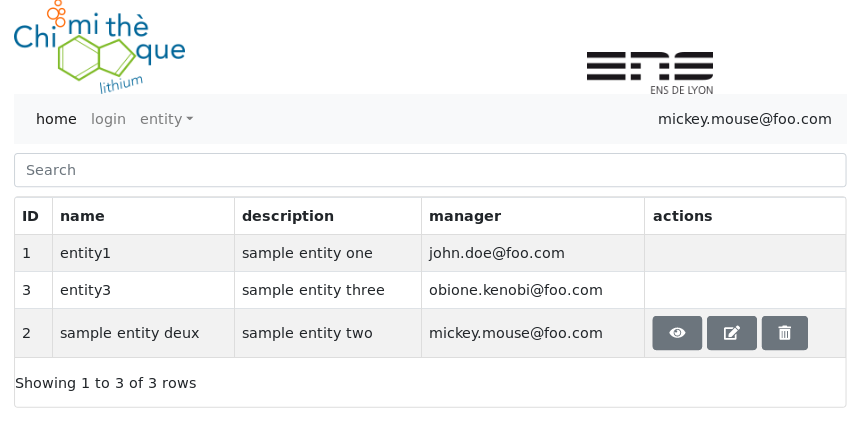

- [Chimithèque](#chimith%c3%a8que)
- [Quick start (to have a quick view of the application)](#quick-start-to-have-a-quick-view-of-the-application)
- [Production installation](#production-installation)
  - [Requirements](#requirements)
  - [Installation](#installation)
    - [Binary command line parameters](#binary-command-line-parameters)
  - [Setting up application administrators](#setting-up-application-administrators)
- [Database backup](#database-backup)
- [Chimithèque V2 initial database import](#chimith%c3%a8que-v2-initial-database-import)
  - [Principle](#principle)
  - [Importing from another public instance](#importing-from-another-public-instance)
- [Chimithèque V1 database migration](#chimith%c3%a8que-v1-database-migration)
  - [Export](#export)
    - [PostgreSQL](#postgresql)
  - [Import](#import)
- [Upgrades](#upgrades)
- [Support](#support)
- [V1/V2 version](#v1v2-version)
- [List of public database Chimithèque instances](#list-of-public-database-chimith%c3%a8que-instances)

# Chimithèque

Chimithèque is an open source chemical product management application started by the ENS-Lyon (France) and co-developped with the Université Clermont-Auvergne (France). It is written in Golang.

*projet leader*: Delphine Pitrat (delphine[dot]pitrat[at]ens-lyon[dot]fr)

The project has started in 2015 and has moved to Github in 2017.

Main goals:
- simplicity: do one think (stores products) but do it well
- security: provide a global listing of the chemicals products storages
- cost/ecology: borrow a product before ordering a new one



# Download

Chimithèque releases can be downloaded here: <https://github.com/tbellembois/gochimitheque/releases>.

Download the `gochimitheque` binary (in the assets section), not the source code archive.

The permanent link to the latest release is <https://github.com/tbellembois/gochimitheque/releases/latest/download/gochimitheque>

# Quick start (to have a quick view of the application)

You need a Linux AMD64 machine with `Glibc2.28` minimum. No dependencies are required.

1. download the latest `gochimitheque` binary here <https://github.com/tbellembois/gochimitheque/releases/latest/download/gochimitheque>
2. uncompress is in a directory
3. run `./gochimitheque --disableautoupgrade`
4. open your web browser at `http://localhost:8081/login`

Et voilà !

Now login with the email `admin@chimitheque.fr` and password `chimitheque`, and change the password immediatly.

Do not use this mode in production.

# Production installation

## Requirements

- linux (Chimithèque can be cross compiled to run on Windows but binaries are not provided and this documentation does not cover this situation)
- an SMTP server (for password recovery)

## Installation

It is strongly recommended to run Chimithèque behind an HTTP proxy server with SSL.

- create a dedicated user

```
    groupadd --system chimitheque
    useradd --system chimitheque --gid chimitheque
    mkdir /usr/local/chimitheque
```

- drop the gochimitheque binary into the `/usr/local/chimitheque` directory

- setup permissions

```
    chown -R  chimitheque:chimitheque /usr/local/chimitheque
```

- configure (look at the following section) and install the systemd script `doc/chimitheque.service` in `/etc/systemd/system` and enable/start it with `systemctl enable chimitheque.service; systemctl start chimitheque.service`

- install and adapt the Nginx configuration `doc/nginx-chimitheque.conf` in `/etc/nginx/server-available/nginx.conf` and link it with `ln -s /etc/nginx/server-available/nginx.conf /etc/nginx/server-enable/nginx.conf`

### Binary command line parameters

You need configure the systemd script with the following parameters:

- `-listenport`: application listening port - default = `8081`
- `-useproxy`: use an HTTP proxy - default = `false`
- `-proxyurl`: proxy base URL with no trailing slash
- `-proxypath`: proxy path - default = `/`
- `-mailserveraddress`: SMTP server address - *REQUIRED*
- `-mailserverport`: SMTP server port - *REQUIRED*
- `-mailserversender`: SMTP server sender email - *REQUIRED*
- `-mailserverusetls`: use an SMTP TLS connection - default = `false`
- `-mailservertlsskipverify`: skip SSL verification - default = `false`
- `-enableautoupgrade`: enable application auto upgrade - recommended - default = `false`
- `-enablepublicproductsendpoint`: enable public products endpoint - default = `false`
- `-admins`: comma separated list of administrators emails that must be present in the database
- `-resetadminpassword`: reset the `admin@chimitheque.fr` admin password to `chimitheque`
- `-logfile`: output log file - by default logs are sent to stdout
- `-debug`: debug mode, do not enable in production

> example:
>
> `gochimitheque -proxyurl=https://appserver.foo.fr -proxypath=/chimitheque/ -admins=john.bar@foo.fr,jean.dupont@foo.fr -mailserveraddress=smtp.foo.fr -mailserverport=25 -mailserversender=noreply@foo.fr"`
>
> will run the appplication behind a proxy at the URL `https://appserver.foo.fr/chimitheque` with 2 additionnal administrators `john.bar@foo.fr` and `jean.dupont@foo.fr`

## Setting up application administrators

A static administrator `admin@chimitheque.fr` is created during the installation. His password must be changed after the first connection.

You can add additional administrators with the `-admins` command line parameters. Note that those admins must already be present in the database.

> example: `-admins=john.bar@foo.com,jean.dupont@foo.com`

# Database backup

Chimithèque uses a local sqlite database. You are strongly encouraged to schedule regular plain text dump in a separate machine in case of disk failure.

You can backup the database with:
```bash
    sqlite3 /path/to/chimitheque/storage.db ".backup '/path/to/backup/storage.sq3'"
```
# Chimithèque V2 initial database import

## Principle

Each Chimithèque application administrator can share its products database with `-enablepublicproductsendpoint`.
Note that only products informations (product cards) will be shared.

You need at least one other public Chimithèque instance to be able to populate your new Chimithèque database.

## Importing from another public instance

```bash
    ./gochimitheque -importfrom=[publicInstance]
```

example:
```bash
    ./gochimitheque -importfrom=https://chimitheque.ens-lyon.fr
```

# Chimithèque V1 database migration

## Export

Databases of the V1 version must be exported into `CSV` to be imported in the V2 version.

### PostgreSQL

In PostgreSQL this can be done with the command:

```bash
    SCHEMA="public"; DB="{chimitheque-db-name}"; psql -U {chimitheque-user} -h {chimitheque-host} -p {chimitheque-port} -Atc "select tablename from pg_tables where schemaname='$SCHEMA'" $DB | while read TBL; do psql -U {chimitheque-db-name} -h {chimitheque-host} -p {chimitheque-port} -c "COPY $SCHEMA.$TBL TO STDOUT WITH CSV HEADER" $DB > $TBL.csv; done;
```

This will generate one CSV file per table.

## Import

You can then import to the V2 version with:

```bash
    /path/to/gochimitheque -proxyurl=https://appserver.foo.fr -importfrom=/path/to/csv
```

This is important to specify the correct `-proxyurl` parameter as it will be used to generate the storages qr codes.

# Upgrades

You can enable automatic upgrades when a new release is published with the `enableautoupgrade` command line parameter.

This is strongly recommended to always run the last version of the application.

If you prefer to perform a manual upgrade just stop it and replace the `gochimitheque` binary with the new one.

# Support

Please do not contact the members of the Chimithèque development team directly.

Subscribe to the mailing list: <https://groupes.renater.fr/sympa/subscribe/chimitheque?previous_action=info> or open a Github issue.

# V1/V2 version

The v2 version has been rewritten in Golang.

- dramastically faster
- much easier to deploy (zero dependencies, embeded database)
- responsive design
- simplified GUI

# List of public database Chimithèque instances

- ENS de Lyon: `https://chimitheque.ens-lyon.fr`

If you want to share your product database please send an email to the mailing list or create a Github issue.