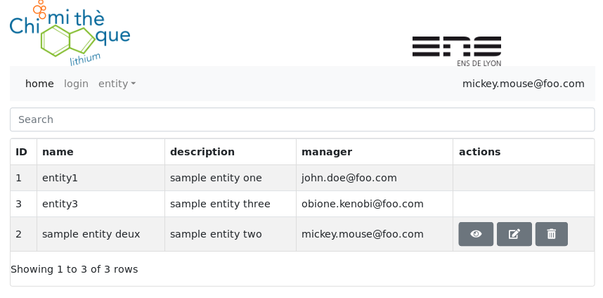

# Chimithèque

Chimithèque is an open source *chemical product, biological reagent and lab consumables* management application developped by the ENS-Lyon (France). It is written in *Golang* and *Rust*.

The project was started in 2015 and moved to Github in 2017.

It is released under the [GPL v3 License](LICENSE).

## Team

- *projet leaders*: Delphine Pitrat - ENS-Lyon (delphine[dot]pitrat[at]ens-lyon[dot]fr) - Thomas Bellembois - UCA (thomas[dot]bellembois[at]uca[dot]fr)
- *technical referent - chemistry*: Delphine Pitrat

## Screenshot



## Web browser compatibility

Chimithèque does NOT work with Microsoft Edge.
It was tested successfully with Firefox/Brave.

# Links

- project home: <https://github.com/tbellembois/gochimitheque>
- docker image: <https://hub.docker.com/repository/docker/tbellembois/gochimitheque>

# 2.1.0 News!

Here is the list of the major technical changes from the `2.1.0` version:
- the only supported installation is with Docker (this may change in the future)
- the authentication is based on OpenID managed by the Keycloak (<https://www.keycloak.org/>) application.
- the LDAP configuration has been removed from Chimithèque to be handled by the OpenID server

# Requirements

- a *Linux AMD64* machine (glibc 2.34 min)
- [Docker](https://docs.docker.com/get-docker/) and [docker-compose](https://docs.docker.com/compose/install/)
- an SMTP server
- an HTTPS certificate
- the sqlite command line tool if upgrading an existing installation

# Upgrading from 2.0.*

Important: if you upgrade to a `2.1.*` version coming from a `2.0.*` version you *must* first perform the upgrades up to the `2.0.8` version.

1. Backup your *entire* installation folder and database.

## Export users

1. Retrieve the latest release of the `chimitheque_people_keycloak_exporter` binary from <https://github.com/tbellembois/chimitheque_people_keycloak_exporter/releases>.

2. Copy the binary in your *current* Chimithèque installation (where the `storage.db` file is).

3. Run the binary:
```
chmod +x chimitheque_people_keycloak_exporter
./chimitheque_people_keycloak_exporter
```

The exporter will create a `keycloak.json` file. Keep it for later use.

> Note that the exporter will panic if your database contains duplicate (case insensitive) emails. In the previous versions of Chimithèque, emails were case sensitive. You could have duplicate emails with different cases. The new version uses case insensitive email comparison to avoid duplicates.

## Migrate database

1. From your *current* Chimithèque installation (where the `storage.db` file is), retrieve the `sql` files

```bash
wget https://raw.githubusercontent.com/tbellembois/chimitheque_db/refs/heads/main/src/resources/shema.sql
wget https://raw.githubusercontent.com/tbellembois/chimitheque_db/refs/heads/main/src/resources/migration.sql
```

2. Run the migration script

```bash
sqlite3 chimitheque.sqlite < shema.sql && sqlite3 chimitheque.sqlite < migration.sql
```

This will create a new `chimitheque.sqlite` file. Keep it for later.

# Installation

The following commands are to be executed in the `/root` directory (you can change it) with the `root` account. 

1. Retrieve the Chimithèque `docker-compose.yml` and `compose-prod.env` files:
```bash
cd /root
wget https://raw.githubusercontent.com/tbellembois/gochimitheque/master/docker-compose.yml -O docker-compose.yml
wget https://raw.githubusercontent.com/tbellembois/gochimitheque/master/compose-prod.env -O .env
```

2. Edit the `.env` file, it is self documented. You can use the command `pwgen -s -B 16` to generate secure passwords.

3. Create the `data` directory (and sub directories) for the container data.
```bash
mkdir -p /root/docker/keycloak
mkdir /root/docker/alpine
mkdir /data
mkdir -p /data/docker-keycloak/templates/
mkdir -p /data/docker-nginx/nginx-templates/
mkdir /data/docker-nginx/nginx-conf/
mkdir /data/docker-nginx/nginx-auth/certs/
mkdir -p /data/docker-chimitheque/chimitheque-db/
mkdir /data/docker-postgres/
```

> If you want to choose another directory for the container data,you will have to replace the `/data` strings in the `docker-compose.yml` file (`volumes` sections). In this documentation we assume that the default directory is kept.

4. Retrieve the containers configuration files:
```bash
wget https://raw.githubusercontent.com/tbellembois/gochimitheque/master/docker/keycloak/Dockerfile -O /root/docker/keycloak/Dockerfile
wget https://raw.githubusercontent.com/tbellembois/gochimitheque/master/docker/alpine/Dockerfile -O /root/docker/alpine/Dockerfile
wget https://raw.githubusercontent.com/tbellembois/gochimitheque/master/docker/keycloak/chimitheque-realm-template.json -O /data/docker-keycloak/templates/chimitheque-realm-template.json
wget https://raw.githubusercontent.com/tbellembois/gochimitheque/master/docker/keycloak/chimitheque-users-0.json -O /data/docker-keycloak/templates/chimitheque-users-0.json
wget https://raw.githubusercontent.com/tbellembois/gochimitheque/master/docker/nginx/default.conf.template -O /data/docker-nginx/nginx-templates/default.conf.template
wget https://raw.githubusercontent.com/tbellembois/gochimitheque/master/docker/nginx/nginx.conf -O /data/docker-nginx/nginx-conf/nginx.conf
```

5. Copy your https certificate `crt` and `key` files in `/data/docker-nginx/nginx-auth/certs/`. Your certificate *must* contain the certification chain.
They *must* be named `chimitheque.crt` and `chimitheque.key`.

6. If upgrading from a previous version copy the `chimitheque.sqlite` file in `/data/docker-chimitheque/chimitheque-db/`.

7. Build the keycloak image:
```bash
docker compose build
```

8. Pull the other images:
```bash
docker compose pull
```

9. Start up and wait a moment (it can take several minutes for the containers to start the first time):
```bash
docker compose up -d
```

# Configuration

## Admin user creation

1. Connect to the OIDC server at <https://your_chimitheque_url/keycloak> with the username `admin@chimitheque.fr` and the value of your `KEYCLOAK_ADMIN_PASSWORD` for password.

2. On the top left corner drop-down list choose the `chimitheque` realm. Then click on `Users` on the left column.

3. Click the `Create new user` button and enter the following informations:
```
Email verified: yes
Email: admin@chimitheque.fr
```
And click the `Create` button.

4. Then click on the `Credentials` tab and the `Set password` button. Enter the value of your `KEYCLOAK_ADMIN_PASSWORD`, uncheck `Temporary` and click on `Save`.

## Importing previous users (migration from 2.0.8 only)

If you migrate from a `2.0.8` version you should have a `keycloak.json` file from the `Upgrading from 2.0.*` section.

1. Click on `Realm settings` on the left colums, then on the top right drop-down list `Action` choose `Partial import`.

2. Browse and upload your `keycloak.json` file, click on the `Choose the resources your want to import` checkbox and click on the `Import` button.

## Setup the smtp configuration

1. Click on `Realm settings` on the left colums, then the `Email` tab.

2. Fill in the required information.

## Additionnal configuration

You mail want to enable/disable user registration as well as activate the LDAP connectivity. Please refer to the [Keycloak documentation](https://www.keycloak.org/docs/latest/server_admin/#_ldap) for more information.

# Connection

Then open your web browser at `https://your_chimitheque_url`

Et voilà !

Now login with the email `admin@chimitheque.fr` and the value of your `KEYCLOAK_ADMIN_PASSWORD` password.

# Administrators

A static administrator `admin@chimitheque.fr` with id `1` is created during the installation. It is hardcoded and must not be deleted.
You can add a comma separated list of admins emails. You should limit the number of admins and set entity managers instead.
Non existing accounts will be created.

> example: `-admins=john.bar@foo.com,jean.dupont@foo.com`

# Users management

Users permissions are still managed by the Chimithèque application (by admins and entity managers).

There are two ways to manage users:
1. enable user registration in Keycloak (easiest way)
People will have the possibility to create their own account but will NOT be able to connect to Chimithèque until they are affected to an entity.
2. disable user registration in Keycloak
You will have to create users manually in Keycloak. Currently only the account `admin@chimitheque.fr` can access Keycloak, not other admins nor Chimithèque managers. This will be fixed in a future release.

# Database backup

Chimithèque uses a local *sqlite* database. You are strongly encouraged to schedule regular plain text dump in a separate machine in case of disk failure.

You can backup the database with:
```bash
  sqlite3 /path/to/chimitheque/storage.db ".backup '/path/to/backup/storage.sq3'"
```

Restore it with:
```bash
  cp /path/to/backup/storage.sq3 /path/to/chimitheque/storage.db
```

# Upgrades

## Docker installation

```bash
    docker-compose down
    docker-compose pull
    docker-compose up -d --force-recreate
```

# Support

Please do not (never) contact the members of the Chimithèque development team directly.

Subscribe to the mailing list: <https://groupes.renater.fr/sympa/subscribe/chimitheque?previous_action=info> or open a Github issue.

# Use of categories and tags

For chemical and biological reagents, it is now possible to classify products into different categories in order to make product searches easier.

This option is available when creating a new product record through a drop-down menu that suggests several pre-registered product categories. It is also possible to create a new category if the relevant product does not fit any of the existing suggestions.

This feature also allows users, through the advanced search in the main menu, to display only products belonging to a specific category, providing a global view of a particular class of products.

This functionality is complemented by the possibility of applying tags to chemical or biological reagents, which is also available in the product sheet section. Tags allow a product to be associated with various fields, methods, protocols, projects, or application domains.

As with categories, pre-registered tags are suggested in a scrolling menu, with the possibility of creating new tags if needed. For example, a stem cell culture medium can be associated with tags such as Stem Cells, Cell Culture, or Culture Medium.

This feature is particularly useful for quickly identifying products associated with a specific activity, project, or method through the advanced search in the Chimithèque main menu. Moreover, it provides a way to personalize and adapt product searches according to the specific needs or practices of a laboratory or organization.

# Use of barecode and QRCode

A new option is now available for creating an association between a product and a specific label: the QR code.

It differs from the barcode because it can be read by any device with a camera and allows direct access to the page containing the product’s storage information.

By default, when a product is stocked, the software creates a random barcode and a new QR code. However, if a product needs to be sampled, you can select the “identical barcode” option when specifying the number of samples. This will generate the same barcode for each new sample.

The main advantage is that scanning the QR code of any of these identical products will display the storage page containing all the samples. From there, any of the samples can be borrowed or archived.

For example, in some cases it is recommended to limit freeze–thaw cycles for conservation purposes. To avoid repeated freeze–thaw cycles, the product can be divided into several containers with the same volume or mass.

When storing them in Chimitheque, the “identical barcode” option allows the creation of QR codes linked to all the samples, so that any of them can be removed from storage when one is used.
